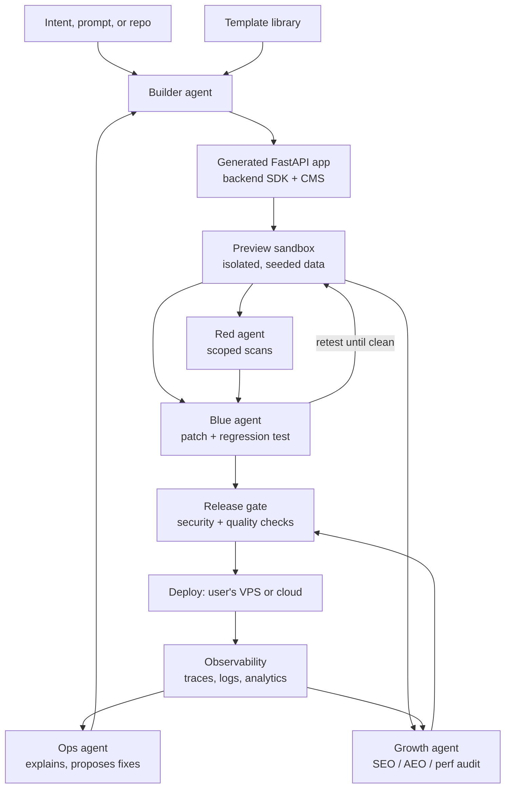

# RedBlue: Adversarially Hardened Web Development Platform — Project Plan

**Stack:** Python / FastAPI · **License:** Apache-2.0 · **Distribution:** open source on GitHub, self-deployed by users

---

## 1. Vision

The ultimate web development platform collapses the distance between "I have an idea" and "it's live, secure, and getting traffic." Agents do most of the work; humans steer and approve.

RedBlue is one self-hostable platform that covers the whole lifecycle:

| Layer | What it does |
|---|---|
| **Builder** | Turns intent into a real, ejectable FastAPI codebase |
| **Backend** | Database, auth, storage, jobs, and AI behind one typed SDK |
| **CMS** | Block-based content editing with SEO/AEO fields built in |
| **Template library** | Extensive, pre-hardened, search-optimized page types |
| **Security gate** | Red agent tests every change; Blue agent patches with regression tests |
| **Observability** | Traces, logs, metrics, and an agent that explains what went wrong |
| **Growth engine** | SEO, AEO/GEO, marketing, and traffic optimization |

### The wedge

> **The platform where AI-built sites are adversarially hardened *and* built to be found.**

Security is what makes it trustworthy; growth is what makes it worth using. Every other layer feeds one of those two promises.

---

## 2. Architecture overview



### Core design principles

1. **Everything is real code.** Generated apps are plain FastAPI projects users can eject and own.
2. **Server-rendered by default.** Fast HTML is the foundation for SEO, AEO, and Core Web Vitals.
3. **Every change passes the gate.** Security and quality checks apply to agent-written and human-written code alike.
4. **Humans approve anything public.** Publishing, deploying, sending email, and posting are always human-confirmed.
5. **Self-hosted and portable.** No dependency on any hosted RedBlue service.
6. **Bring your own key.** Users supply their own Claude API key.

---

## 3. Technology stack

| Concern | Choice | Notes |
|---|---|---|
| Backend framework | FastAPI | Async, typed, OpenAPI spec for free |
| Rendering | Jinja2 + HTMX | Server-rendered HTML; interactivity without a heavy JS build |
| Styling | Tailwind (standalone CLI) | No Node toolchain required |
| Data models | Pydantic v2 + SQLAlchemy 2 | Shared schemas across API, CMS, and agents |
| Database | Postgres | SQLite supported for local dev |
| Migrations | Alembic | |
| Background jobs | Postgres-backed queue (e.g. Procrastinate) | Avoids Redis as a hard dependency |
| Workflows | Durable orchestrator (Temporal optional; lightweight built-in default) | For long-running agent and scan workflows |
| Storage | S3-compatible (local disk in dev) | MinIO, R2, S3, etc. |
| Auth | Built-in sessions + OAuth providers | Passkeys as a stretch goal |
| Observability | OpenTelemetry | Exports to built-in store or any OTel backend |
| AI | Anthropic SDK / Agent SDK | BYOK |
| Admin UI | FastAPI + HTMX | Same stack as generated apps |

---

## 4. Components

### 4.1 Builder agent

Turns a description, a template choice, or an existing repo into a working app.

- **Plan → scaffold → implement → verify** loop, with the plan shown to the user for approval first.
- Starts from the **template library** and **backend SDK** instead of generating from nothing, so output is consistent and pre-hardened.
- Writes tests alongside features; nothing is "done" until tests pass and the gate is green.
- Works on **branches and PRs**, never directly on main.
- **Ejectable:** the output is a normal repo with no hidden runtime dependency on the builder.

### 4.2 Backend platform (`redblue.core`)

One typed Python SDK for the primitives every site needs:

- **Data:** models, migrations, typed queries, seed data
- **Auth:** users, roles, sessions, OAuth, API keys, rate limiting
- **Storage:** uploads, image resizing, signed URLs
- **Jobs:** background tasks, scheduled jobs, retries
- **Email:** transactional email via pluggable providers (SMTP, Resend, SES, etc.)
- **AI:** a thin wrapper for model calls with caching, cost tracking, and structured outputs
- **Webhooks:** signed inbound and outbound webhooks
- **Secure defaults:** CSRF protection, strict security headers, CSP, safe cookie settings, parameterized queries only

### 4.3 CMS (`redblue.cms`)

A built-in, Postgres-backed content system.

- **Block-based editor** — content is structured JSON validated by Pydantic block schemas, not raw HTML.
- **Collections** — posts, docs, FAQs, case studies, glossary terms, locations, products, etc., each with its own schema.
- **Drafts, scheduled publishing, revisions, rollback.**
- **Roles and workflows** — writer → editor → publisher approval.
- **Media library** with automatic image optimization and required alt text.
- **SEO/AEO panel on every entry** — title, meta description, canonical, schema type, FAQ blocks, author, update date, target questions.
- **Headless API** — every collection is also exposed via typed REST, so users can pair it with other frontends.
- **Content agent** — drafts, edits, and refreshes content on request; every agent-written entry is marked as a draft for human review.

### 4.4 Template library (`redblue.templates`)

An extensive library of page types. Every template ships:

- Server-rendered, responsive, accessible (WCAG 2.1 AA) markup
- Preset **schema.org JSON-LD** for its page type
- CMS block definitions and SEO/AEO fields
- **Pre-scanned by the security gate** and covered by regression tests
- Core Web Vitals budgets enforced in CI
- Light/dark themes and design tokens so a site's look changes in one place

#### Page types

**Core & marketing**
- Home
- Landing page (several variants)
- About
- Contact
- Pricing
- Features
- Feature detail
- Waitlist / coming soon
- Thank-you / confirmation
- Link-in-bio

**Content & editorial**
- Blog index
- Blog post
- Category / tag archive
- Author profile
- Newsletter archive
- Series / collection page

**Answer & knowledge (AEO-focused)**
- FAQ
- Knowledge base / help center
- Documentation
- Glossary index
- Glossary term
- How-to / tutorial
- Q&A article

**Commercial & comparison**
- Product page
- Product listing
- "X vs Y" comparison
- "Alternatives to X"
- Use-case page
- Industry / solution page
- Integration page
- Case study
- Testimonials / reviews

**Lead generation**
- Lead magnet / download
- Webinar / event
- Event listing
- Newsletter signup
- Free tool / calculator page
- Quiz / assessment

**Local & programmatic**
- Location page
- Service-area page
- Directory listing
- Directory index

**Company & trust**
- Careers
- Job posting
- Changelog
- Roadmap
- Press / media kit
- Team
- Portfolio
- Status page

**Utility**
- Search results
- 404
- Maintenance
- Privacy policy
- Terms of service
- Cookie policy
- Account / dashboard shell
- Login / signup

### 4.5 Security gate (Red/Blue)

The original core of the project, now protecting the whole platform.

- **Red agent** orchestrates proven tools — Semgrep (SAST), dependency audits, OWASP ZAP and Nuclei (DAST) — against the **preview it launched itself**. It chooses what to probe based on the diff and the app's OpenAPI spec, and triages noise. It does not invent exploits.
- **Blue agent** writes a fix plus a failing-then-passing regression test and opens a PR.
- **CMS-aware checks** — stored XSS in content blocks, unsafe embeds, open redirects in link fields, upload validation.
- **Release gate** — required check that blocks deploy until findings above the configured severity are closed.
- Ships in two forms:
  - **GitHub Action** — for any FastAPI repo, even outside the platform
  - **Built-in gate** — runs automatically on every builder and CMS-code change inside the platform

### 4.6 Observability (`redblue.observe`)

- **OpenTelemetry instrumentation** out of the box for requests, DB queries, jobs, and agent calls.
- **Built-in lightweight store and dashboard** for small deployments; export to any OTel backend (Grafana, Honeycomb, etc.) for larger ones.
- **Structured logs** with request correlation.
- **Error tracking** with grouped stack traces.
- **Uptime and synthetic checks** on key pages.
- **Agent cost tracking** — tokens and dollars per agent, per task, per page.
- **Ops agent** — explains anomalies in plain language ("the pricing page got 3x slower after Tuesday's deploy; here's the query") and opens a fix PR through the builder, which then goes through the gate.

### 4.7 Growth engine (`redblue.growth`)

#### SEO

- Server-rendered HTML, clean URLs, automatic canonical tags
- Auto-generated XML sitemaps (split by collection) and `robots.txt`
- Meta and Open Graph tags, plus auto-generated social share images
- Structured data (JSON-LD) validated in CI
- hreflang and multilingual routing
- Internal linking suggestions based on content similarity
- Redirect manager with automatic 301s when slugs change
- Broken link and orphan page detection
- Core Web Vitals budgets per template, checked in CI
- Image optimization (modern formats, responsive sizes, lazy loading)

#### AEO / GEO (Answer and Generative Engine Optimization)

Making content easy for AI assistants and answer engines to find, understand, and cite:

- **Answer-first content blocks** — concise direct answers followed by depth
- **FAQ, HowTo, and Q&A structured data** where the content genuinely fits
- **`llms.txt` generation** summarizing the site's key pages
- **Entity consistency** — organization, author, and product info kept identical across pages and schema
- **Author and source signals** — bylines, credentials, citations, "last updated" dates
- **Freshness monitoring** — flags pages whose facts or dates have gone stale
- **AI crawler controls** — per-crawler allow/deny settings in `robots.txt`, owner's choice
- **AI referral tracking** — identifies traffic arriving from AI assistants and answer engines
- **Question coverage audit** — maps which user questions the site answers well, poorly, or not at all

#### Marketing

- Email capture forms and double opt-in newsletter management
- Pluggable email providers; consent records stored with each subscriber
- UTM link builder and campaign tracking
- A/B testing for headlines, CTAs, and layouts, with significance reporting
- Content calendar tied to CMS scheduling
- **Repurposing agent** — turns a post into social snippets, email copy, and summaries, as drafts
- Popups and banners with frequency caps and accessibility rules

#### Traffic optimization and analytics

- **Privacy-friendly, cookieless analytics** by default (no consent banner needed for basic stats in most setups)
- Traffic sources, including search, social, referral, email, and AI assistants
- Conversion funnels and goal tracking
- **Search Console integration** for queries, impressions, and click-through rates
- **Growth agent** — weekly report of what's working, pages losing traffic, content gaps, and a prioritized list of improvements, each as a proposed PR or CMS draft

#### Growth guardrails (white-hat only)

Built in, not optional, because the platform's reputation depends on it:

- No cloaking, hidden text, doorway pages, or fake reviews
- **Programmatic pages require unique, useful content** — a quality threshold blocks thin or duplicate pages from publishing
- No bot traffic, fake engagement, or automated link schemes
- No scraping or republishing other people's copyrighted content
- Outreach and social posts are **drafted, never auto-sent**
- Clear labeling of AI-assisted content where the owner chooses or law requires

---

## 5. Agents

| Agent | Role | Suggested model |
|---|---|---|
| Builder | Plans and implements features | `claude-sonnet-5` |
| Red | Triages diffs, picks probes, filters noise | `claude-haiku-4-5-20251001` |
| Blue | Fixes + regression tests | `claude-sonnet-5` |
| Content | Drafts, edits, refreshes CMS content | `claude-sonnet-5` |
| Growth | SEO/AEO audits, reports, suggestions | `claude-haiku-4-5-20251001` for audits; `claude-sonnet-5` for recommendations |
| Ops | Explains anomalies, proposes fixes | `claude-haiku-4-5-20251001` for triage; `claude-sonnet-5` for fixes |

### Agent rules

- All outputs validated against Pydantic schemas before touching code or content.
- All code changes go through PRs and the security gate.
- All content changes land as drafts.
- Anything public (deploy, publish, send, post) needs human approval.
- Per-agent spend limits and token logging.

---

## 6. Claude credits and costs

- **Users bring their own API key.** Your promotional credits fund **development, eval runs, template testing, and the project's CI**, not users' usage.
- Use a dedicated Claude Console workspace with a spend limit for this project.
- **Prompt caching** for repeated context (system prompts, repo and site summaries).
- **Batch API** for non-urgent work: nightly growth audits, bulk content refreshes, scheduled scans.
- Publish **expected monthly cost** per site size in the README.

---

## 7. Security design (non-negotiable)

- **Red agent is hard-scoped** to previews it launched itself. No target-URL input.
- **No `pull_request_target` with PR code checkout** in the Action. Fork PRs skip AI steps.
- **Least privilege everywhere** — scoped GitHub tokens, per-role CMS permissions, per-agent tool access.
- **Scanned code and user content are treated as hostile**, including prompt-injection attempts inside CMS content read by agents.
- **Fix PRs are never auto-merged.**
- **Secrets** live in environment/secret managers, never in the repo or CMS.
- **Secure-by-default templates** — CSP, security headers, CSRF, output escaping.
- `SECURITY.md` with a disclosure process; the project dogfoods its own gate.

---

## 8. Deployment (for self-hosters)

RedBlue is not hosted by the project. Users deploy it themselves with one of:

| Option | Audience |
|---|---|
| **Docker Compose** | Most users; one command on any VPS |
| **Bare-metal install script (Debian/Ubuntu + systemd)** | Users who avoid containers |
| **One-click deploy configs** (Fly.io, Render, Railway, etc.) | Users who want a managed host |
| **GitHub Action only** | Teams who just want the security gate |

Includes backups, migrations on upgrade, and a `redblue doctor` command that checks configuration.

---

## 9. Repository structure (monorepo)

```
redblue/
├── README.md                 # Quickstart, costs, deploy options
├── LICENSE                   # Apache-2.0
├── SECURITY.md
├── CLAUDE.md                 # Rules for AI coding sessions on this repo
├── docs/
│   └── PLAN.md               # This document
├── packages/
│   ├── core/                 # Backend SDK: data, auth, storage, jobs, email, AI
│   ├── cms/                  # Collections, blocks, editor, workflows, headless API
│   ├── templates/            # Page-type templates, themes, design tokens
│   ├── builder/              # Builder agent
│   ├── gate/                 # Red/Blue agents, scanners, release gate
│   ├── observe/              # OTel setup, dashboard, error tracking, ops agent
│   ├── growth/               # SEO, AEO/GEO, marketing, analytics, growth agent
│   └── cli/                  # `redblue` CLI: new, dev, build, deploy, doctor
├── action/                   # GitHub Action wrapper for the gate
├── admin/                    # Admin UI (FastAPI + HTMX)
├── deploy/
│   ├── compose/
│   ├── systemd/
│   └── platforms/            # Fly, Render, Railway configs
├── examples/
│   ├── vulnerable-demo/      # For gate demos and tests
│   └── starter-site/         # Full site built from templates
└── evals/                    # Agent evals: FP rate, fix acceptance, content quality, cost
```

---

## 10. Roadmap

Sequenced so each phase ships something usable and the security wedge lands first.

| Phase | Duration | Deliverable |
|---|---|---|
| **0. Foundations** | 2 weeks | Monorepo, schemas, CLI skeleton, CI, eval harness, vulnerable demo |
| **1. Security gate** | 6 weeks | Red/Blue pipeline, fix PRs, GitHub Action, Marketplace listing |
| **2. Backend SDK + CMS core** | 6–8 weeks | Data, auth, storage, jobs; collections, blocks, drafts, admin UI |
| **3. Template library v1** | 4–6 weeks | ~15 core page types with schema, SEO fields, gate coverage |
| **4. Builder agent** | 6 weeks | Template-based scaffolding, feature implementation, PR workflow |
| **5. SEO + AEO/GEO** | 4 weeks | Sitemaps, schema validation, llms.txt, crawler controls, audits |
| **6. Observability** | 4 weeks | OTel, dashboard, error tracking, ops agent |
| **7. Marketing + traffic** | 6 weeks | Analytics, forms, newsletter, A/B testing, growth agent |
| **8. Template library v2** | Ongoing | Full page-type catalog, community contributions |

**Total to full platform:** roughly 10–12 months solo. Phase 1 alone is a shippable, useful product.

---

## 11. Success metrics

**Security gate**
- False-positive rate
- Fix acceptance rate (Blue PRs merged without edits)
- Regression test pass rate

**Builder and templates**
- Time from idea to deployed site
- Share of generated code passing the gate on first run
- Template Core Web Vitals scores

**Growth**
- Indexed pages, impressions, and clicks (Search Console)
- AI assistant referral traffic
- Question coverage score
- Conversion rate on lead-generation templates

**Platform**
- Cost per site per month
- Self-host install success rate (`redblue doctor` passes)
- Stars, installs, active deployments, contributors

---

## 12. Decisions

**Made**
- Stack: FastAPI + Postgres, server-rendered with Jinja2 + HTMX
- License: Apache-2.0
- Distribution: open source on GitHub, self-deployed by users
- Builder, CMS, backend, observability, growth engine, and template library are in scope

**Open**
- Project name
- Built-in durable workflow engine vs. Temporal as default
- Which ~15 templates make the v1 cut
- Default email provider integration
- Whether analytics is built in only or also exports to external tools in v1
